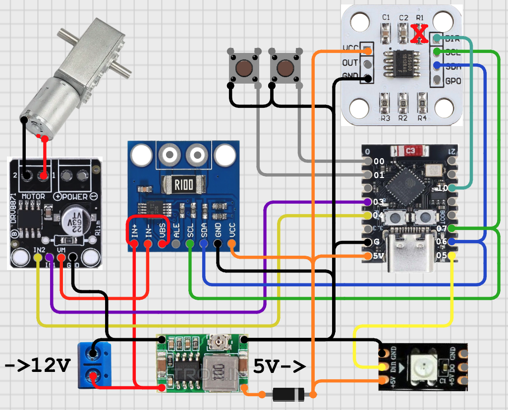
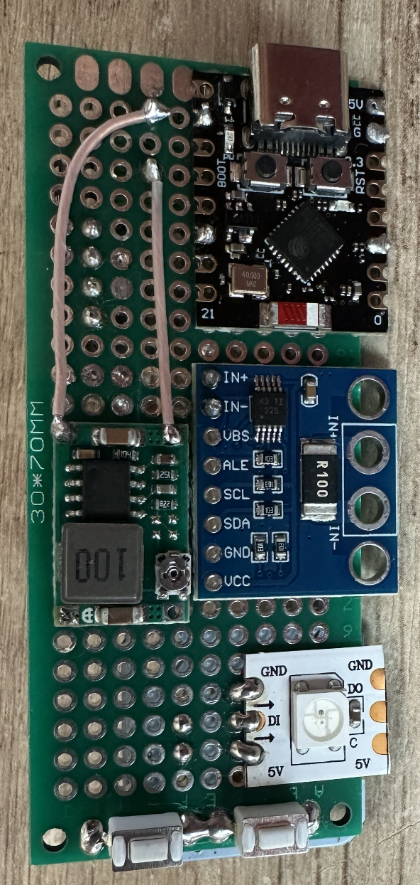
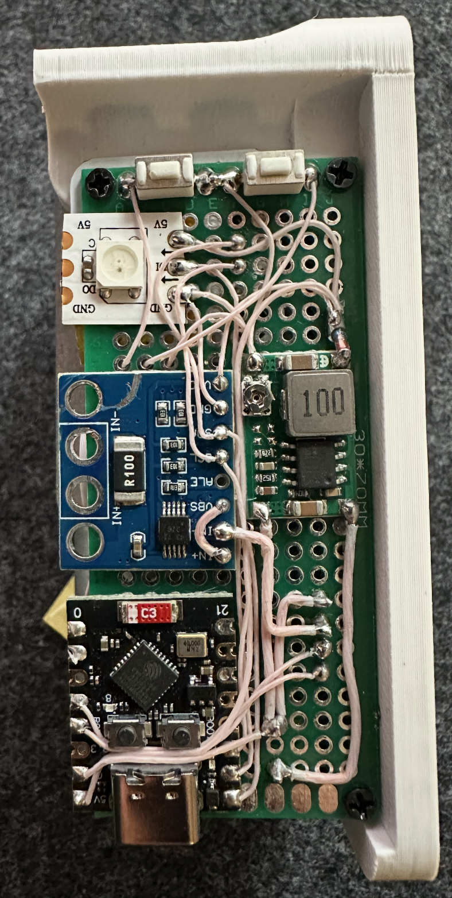
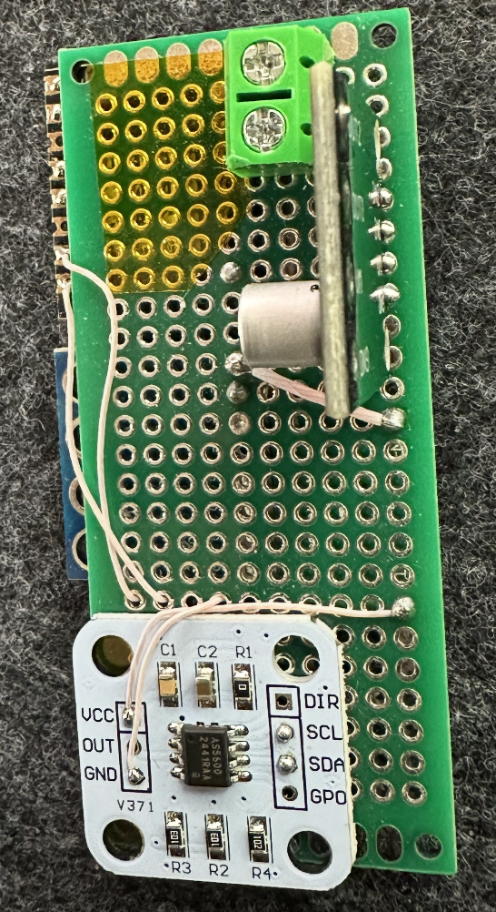
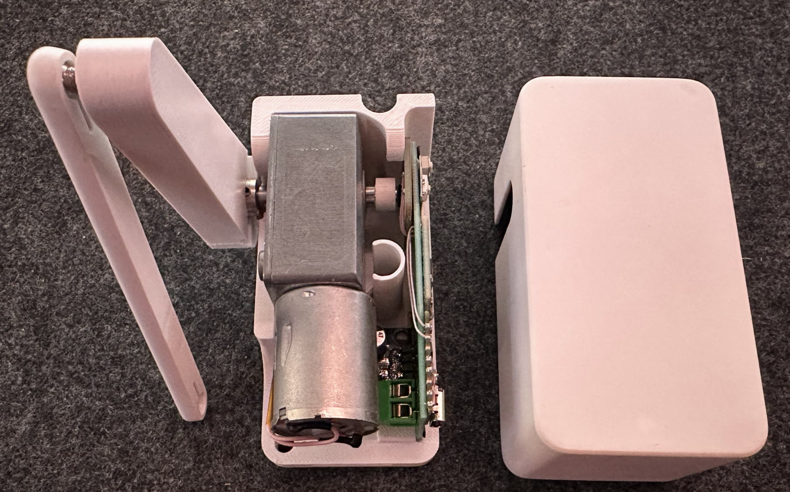

# 🪟 Dimvent ESPHome

**Умный привод для автоматизации окон** на основе мотор-редуктора с прошивкой ESPHome. 

## ✨ Возможности

- **🎯 Точное позиционирование** - Магнитный датчик AS5600 отслеживает положение вычага
- **🛡️ Защита от преград** - Датчик тока INA219 обнаруживает препятствия и автоматически предпринимаются повторные попытки с возвратом на исходное
- **🤖 Автономная работа** - Локальное управление ESPHome и Home Assistant

## 🔧 Компоненты

| Название | Ссылка | Описание |
| :--- | :--- | :--- |
| Мотор-редуктор 12V 6RPM | [Ozon](https://ozon.ru/t/GNIRneC) | Силовой привод с двумя валами |
| AS5600 + магнит | [Ali](https://aliexpress.ru/item/1005008249897817.html) | Магнитный энкодер для точного позиционирования |
| INA219 | [Ali](https://aliexpress.ru/item/1005006369070438.html) | Датчик тока и напряжения для защиты |
| Mini360 | [Ali](https://aliexpress.ru/item/1005008400769897.html) | Понижающий DC-DC преобразователь |
| DRV8871 | [Ali](https://aliexpress.ru/order-list/5549620160767253) | Драйвер двигателя с поддержкой PWM |
| Диод |-| Диод для установки после понижающего 5в |
| Шары для крепления | [AliExpress](https://sl.aliexpress.ru/p?key=77D9GlK) | Шарнирное соединение для тяги |
| Фланцевая муфта 6мм | [Ali](https://aliexpress.ru/item/1005006306920922.html) | Соединитель вала с рычагом |
| Винт м3х6 (3шт)| [Ali](https://aliexpress.ru/item/1005004567542471.html) |Крепление мотора к корпусу |
| Винт м3х6 (4шт) плоская шляпка|-|Крепление муфты к рычагу |
| ESP32-C3/S3 | - | Мозг системы на ESPHome |
| Печатная плата 3х7 см | [Ozon](https://www.ozon.ru/product/pechatnaya-maketnaya-plata-3x7-sm-dvuhstoronnyaya-dlya-payki-gsmin-pcb1-10-shtuk-zelenyy-1220449711/) | Кастомная монтажная плата |
| Клеммы винтовые 2pin | - | Клеммы для подключения питания |
| WS2812 (1шт) | - | Светодиод для информмирования. Опционально |
| Кнопки (2шт) | [Ali](https://aliexpress.ru/item/4000245786194.html) | Клеммы для подключения питания |

## 🛠️ Сборка устройства

### Схема подключения

    

### Сборка платы

Плата собирается на макетной плате 3x7 см с соблюдением особых условий:
> - Надпись `30х70мм` должна находится у основания
> - Требуется изоляция под контактами AS5600 (VCC/OUT/GND) для предотвращения КЗ(например каптоновый скотч)
> - На Mini360 выставить 5в через диод (необходим для защиты одновременного включения БП и USB)

  
  
  
  

### 🚀 3D модели и сборка

Модели для печати в папке `models`.

Настройки печати:
- ABS
- 100% заполнением

> - Для регулировки длины тяги - продублируйте модель в слайсере и установите необходимую длину
> - Магнит на вале откалибруйте в положении ~90° при закрытом окне (фаска должна быть в сторону мотора) по сенсору **Angle**

## 🎮 Прошивка и настройка

Основной конфигурационный файл: **[`dimvent.yaml`](dimvent.yaml)**

| Объект | Описание |
| :--- | :--- |
| **Window** | Основной объект для управления окном (открыть/закрыть/остановить) |
| **Angle** | Текущий угол поворота вала в градусах |
| **Position** | Положение окна в процентах (0% - закрыто, 100% - открыто) |
| **Power** | Мониторинг потребляемой мощности мотора |
| **Unsuccessful attempts** | Счетчик неудачных попыток движения |
| **Attempts exceeded** | Индикатор критической ошибки |
| **Angle Closed Position** | Настройка калибровки положения "Закрыто" |
| **Limit Closed +** | Ограничение тока для закрытия на разных скоростях |
| **Limit Open +** | Ограничение тока для открытия на разных скоростях |
| **Number repeat attempts** | Настройка количества автоматических попыток |
| **Fix problem** | Кнопка сброса ошибок |
| **Motor clockwise** | Ручное управление: вращение по часовой |
| **Motor counterclockwise** | Ручное управление: вращение против часовой |
| **Motor Stop** | Аварийная остановка двигателя |
| **Speed** | Выбор скорости работы (High/Medium/Low) |

## 💡 Финальная настройка

- Откалибруйте **Angle Closed Position** после установки на окно
- Выставите в **Number repeat attempts** необходимое количество попыток
- Настройте **Limit Open/Closed** под конкретное окно для оптимальной работы
- Используйте **Speed** для баланса между скоростью и мощностью

---

**⭐ Нравится проект? Не забудьте поставить звезду на GitHub!**

---

The firmware source code in this repository is licensed under GPLv3. The hardware design files (schematics, 3d models) and documentation are licensed under Creative Commons Attribution-NonCommercial-ShareAlike 4.0 International (CC BY-NC-SA 4.0).
